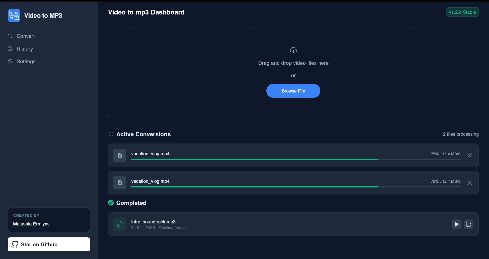

# Video to MP3 Converter 🎬 ➡️ 🎵

A sleek, high-performance desktop application built with Flutter to convert your video files into high-quality MP3 audio.



## Features 🚀

- **Drag & Drop**: Effortlessly upload video files by dragging them into the dashboard.
- **Batch Processing**: Convert multiple videos simultaneously with real-time progress tracking.
- **Modern UI**: A clean, dark-themed interface built for a seamless user experience.
- **Conversion History**: Keep track of your finished conversions and access them directly.
- **Stable Performance**: Optimized for desktop environments with a robust conversion engine.

## Getting Started 🛠️

1. **Clone the repository**:
   ```bash
   git clone https://github.com/matusalaermiyas/video-to-mp3.git
   ```
2. **Install dependencies**:
   ```bash
   flutter pub get
   ```
3. **Run the app**:
   ```bash
   flutter run -d windows
   ```

---

Created with ❤️ by **Matusala Ermiyas**
